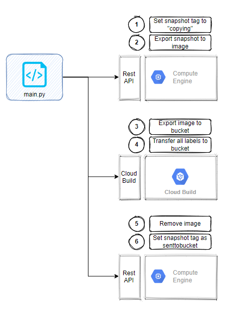

# gcp-snapshot-to-bucket
Module developed for exporting GCP disk`s snapshots for the Cloud Storage. 

# Architecture


# Installation

Necessary tools:

    - Python 3.9.5

## Attention

    - The snapshots will only be exported if the following labels are present in the snapshots` labels metadata: 'database_name','infra_name', 'engine', 'created_at'

## Modules installation

    - pip install -r requirements.txt
    
## Program run
    - Run the program with the following command: 
    
``` python    
python main.py  --project_id <GCP PROJECT ID> `
                --bucket_name <BUCKET NAME> `
                --network_project_id <NETWORK PROJECT ID> `
                --network <NETWORK NAME> `
                --export_format <EXPORT FORMAT> `
                --sub_network <SUB NETWORK NAME> `
                --oauth2_json <AUTHENTICATION FILE>
```

    - Example: 

``` python    
python main.py  --project_id gglobo-dbaaslab-dev-qa `
                --bucket_name disksnapshot `
                --network_project_id gglobo-network-hdg-spk-devqa `
                --network vpc-hdg-devqa `
                --export_format vmdk `
                --sub_network us-east1-gglobo-dbaaslab-dev-qa `
                --oauth2_json gglobo-dbaaslab-dev-qa-818ac58925c9.json
```

    - The program will run in parallel, and eport all the snapshots through created images using Cloud Build
